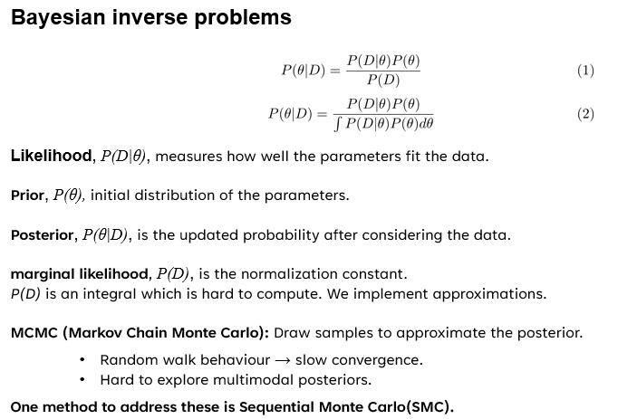
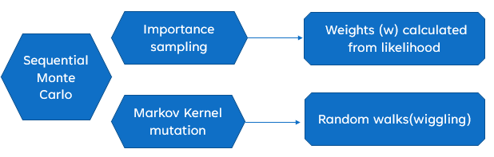
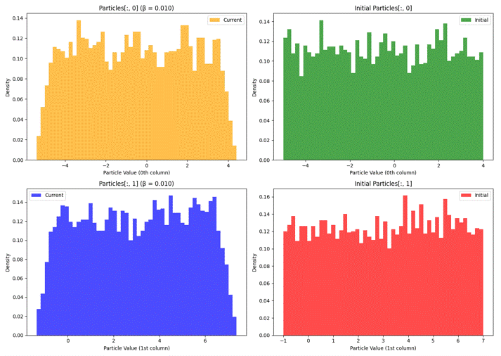
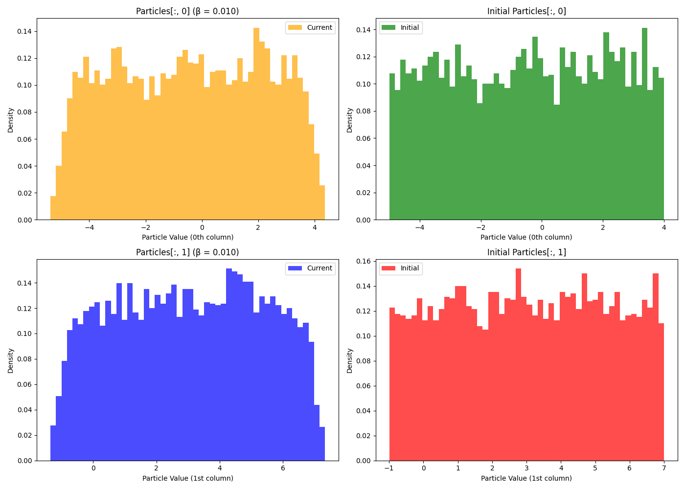
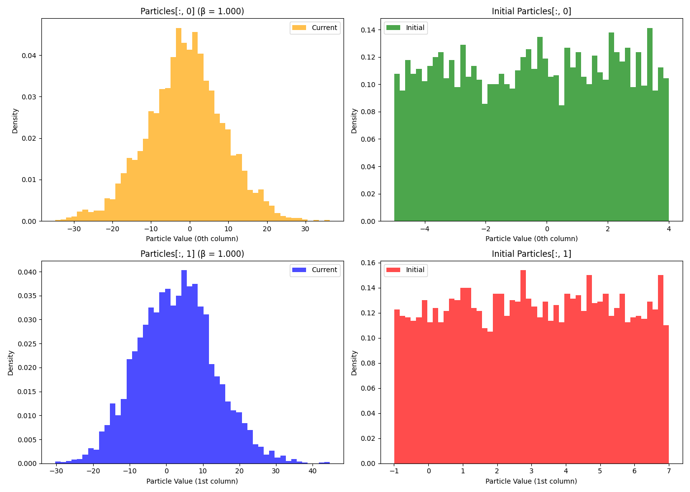

# Bayesian Inversion with Laplace PDE

This project demonstrates **Bayesian inversion** applied to a **Toy Example**.  
The workflow combines **forward PDE simulation** with **sampling-based inference** methods such as **SMC (Sequential Monte Carlo)** and **MCMC (Metropolis-Hastings)** to recover unknown parameters from data.

SMC block Diagram 

**Initial Posterior** Parameter 1 ∼ Uniform[4.0, 5.0] ,Parameter 2 ∼ Uniform[1.0, 7.0]

 

**Final posterior Posterior**

---

## 🔬 Problem Setup
- Forward model: **Laplace PDE** solved on a discretized domain.
- Unknown parameters: coefficients that influence the PDE solution.
- True experiment: generated using a known "ground truth" parameter.
- Bayesian inversion: estimate posterior distributions of parameters given noisy measurements.

---

# 📂 Repository Structure
├── main.py # Main entry point for running Bayesian inversion.

├── laplace_solver.py # PDE forward model (Laplace solver).

├── smc.py # Sequential Monte Carlo implementation.

├── mcmc.py # Metropolis-Hastings MCMC implementation.

├── data/ # (Optional) input datasets or results.

├── results/ # Plots, posterior samples, etc..

└── README.md # Project documentation.
---

##🚀 Future Extensions

Generalize to higher-dimensional PDEs.

Explore adaptive SMC tempering schedules.

Use surrogate models (e.g., Gaussian Processes, Neural Networks) to accelerate infere

📝 Notes

Priors: Uniform or Normal, depending on setup.

Example:

Parameter 1 ∼ Uniform[4.0, 5.0]

Parameter 2 ∼ Uniform[1.0, 7.0]

Or Gaussian priors if posterior is known.

5000 samples were used for exploration in the parameter space.
